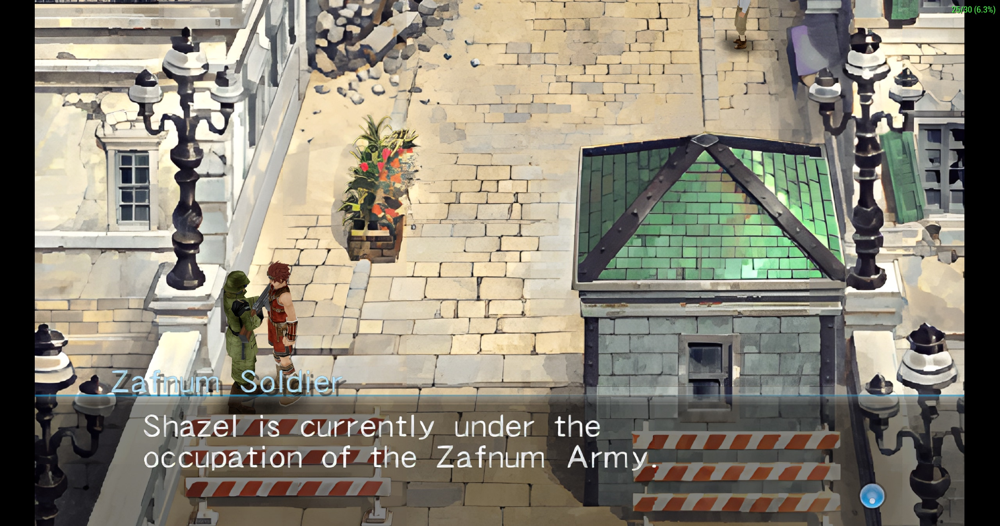
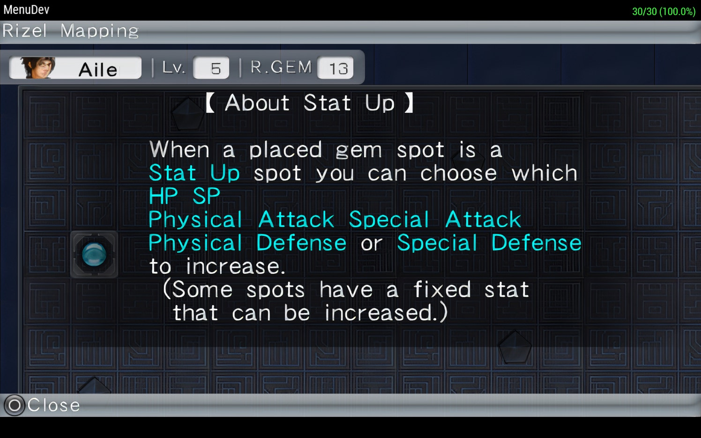
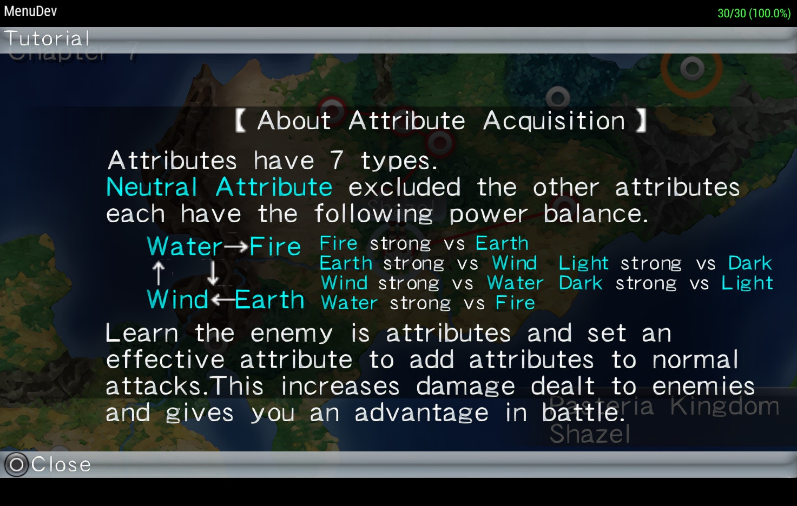
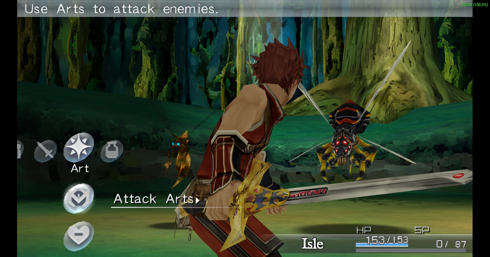

# Rezel Cross — PSP English Translation

English translation project for the PSP game **Rezel Cross**.

## Project Status

* 🟢 Translation: 100%
* 🟡 Hacking: 100%
* 🟢 Graphics: 100%
* 🔴 Testing: Frozen at Chapter 10 — Bug under investigation.

## About

English translation project for the PSP version.

## Features

* English translated text
* English menus
* English graphics
* XDelta translation patch

## Installation

1. Obtain your own copy of the Japanese PSP version of Rezel Cross.
2. Download the latest English translation patch from the [Releases](../../releases) page.
3. Apply the `.xdelta` patch to your original ISO using an XDelta patcher.
4. Play the patched game on a PSP or PSP emulator.

> ⚠️ The original game is not included with this project.

## Screenshots

  
  

  
  

## Credits

* Translation & Hacking: 1vierock

## Changelog

### v0.4

* English translation completed
* Hacking completed
* Testing currently frozen at Chapter 10
* Initial public release
